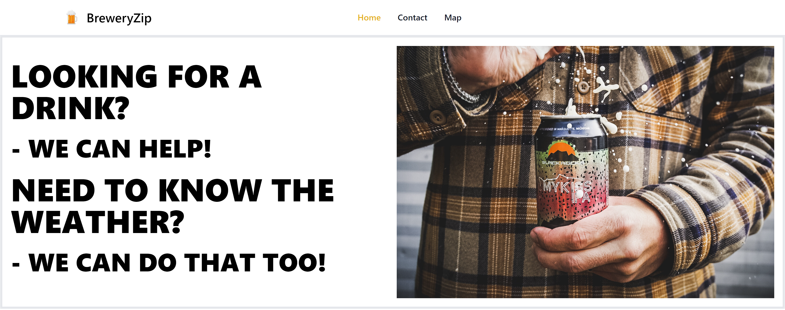

# BreweryZip
## "Looking for a Brewery? We can help! Need to know the weather? We can do that to!"

# USER STORY
I am going on vacation and would like to know where all nearby breweies are located. I would also like to be able to look at the weather forecast for where the brewery is located.

# User Story (Heinz Edit)
As a Beer Lover, I want to seek out different breweies based on the city I am in or visiting, get their location on a map, and know the weather at said brewery. End user goal: Find a brewery in the city I am searching and know the weather forcast. End business goal: Provide beer lovers with a searching tool to find different breweries and know the weather.

# ACCEPTANCE CRITERIA
* **GIVEN**: A webpage with brewery location and weather information.
* **WHEN** I enter the city in the map,
  * **Then** I am presented with nearby breweries and the weather forecast.
* **When** I click on the contacts link,
  * **Then** I am shown the contact information of the website.
* **When** I enter my name and email address,
  * **Then** my information is stored in local storage.

# Authors and Developers
* Stefany Hobson
  * GitHub: [Winner1s](https://github.com/Winner1s)
* Whitney Simpson
  * GitHub: [Whitney-Simpson](https://github.com/Whitney-Simpson)
* Ernest Jones
  * GitHub: [Wruqe](https://github.com/Wruqe)
* Greg Greve
  * GitHub: [Goobergreve09](https://github.com/Goobergreve09)
* Heinz Ulrich V
  * GitHub: [TheOarsman](https://github.com/TheOarsman)

# Creteria for this Project
* Use a CSS framework other than Bootstrap.
* Be deployed to GitHub Pages.
* Be interactive (i.e., accept and respond to user input).
* Use at least two server-side APIs.
* Does not use alerts, confirms, or prompts (use modals).
* Use client-side storage to store persistent data.
* Be responsive.
* Have a polished UI.
* Have a clean repository that meets quality coding standards (file structure, naming conventions, follows best practices for class/id naming conventions, indentation, quality comments, etc.).
* Have a quality README (with unique name, description, technologies used, screenshot, and link to deployed application).

# Third Party API's
We used ____ different Third Party API's for this prioject:
1) [tailwindcss](https://tailwindcss.com/)
2) 
3) 