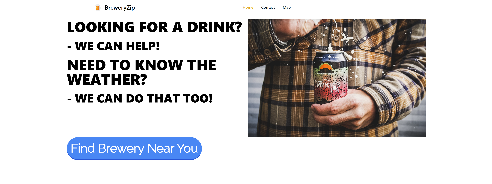

# BreweryZip
## "Looking for a Brewery? We can help! Need to know the weather? We can do that to!"

[BreweryZip](https://whitney-simpson.github.io/Brewery-Search-Engine/#mapWeatherdata)

# User Story
As a Beer Lover, I want to seek out different breweries based on the city I am in or visiting, get their location on a map, and know the weather at said brewery. End user goal: Find a brewery in the city I am searching and know the weather forcast. End business goal: Provide beer lovers with a searching tool to find different breweries and know the weather.

# ACCEPTANCE CRITERIA
* **GIVEN**: A webpage with brewery location and weather information.

* **WHEN** I enter the city in the map,
  * **Then** I am presented with nearby breweries and the weather forecast.
* **When** I click on the contacts link,
  * **Then** I am shown the contact information of the website.
* **When** I enter the city in the search bar,
  * **Then** the map displays said city.
* **When** I press enter after typing city in the search bar,  
  * **Then** the weather is displayed for said city and the search is saved in local storage.
* **When** I return to the placeholder for the city serach, type *Brewery* and press enter,
  * **Then** I am presented with all nearby breweries. 
* **When** I click the *Past City Searches* button,
  * **Then** the most recent search is displayed at the bottom of the screen.
* **When** I refresh the page,
  * **Then** the previous city search is displayed.

# Authors and Developers
* Stefany Hobson
  * GitHub: [Winner1s](https://github.com/Winner1s)
* Whitney Simpson
  * GitHub: [Whitney-Simpson](https://github.com/Whitney-Simpson)
* Ernest Jones
  * GitHub: [Wruqe](https://github.com/Wruqe)
* Greg Greve
  * GitHub: [Goobergreve09](https://github.com/Goobergreve09)
* Heinz Ulrich V
  * GitHub: [TheOarsman](https://github.com/TheOarsman)

# Creteria for this Project
* Use a CSS framework other than Bootstrap.
* Be deployed to GitHub Pages.
* Be interactive (i.e., accept and respond to user input).
* Use at least two server-side APIs.
* Does not use alerts, confirms, or prompts (use modals).
* Use client-side storage to store persistent data.
* Be responsive.
* Have a polished UI.
* Have a clean repository that meets quality coding standards (file structure, naming conventions, follows best practices for class/id naming conventions, indentation, quality comments, etc.).
* Have a quality README (with unique name, description, technologies used, screenshot, and link to deployed application).

# Third Party API's
We used three different Third Party API's for this prioject:
1) [tailwindcss](https://tailwindcss.com/)
2) [Google Maps](https://developers.google.com/maps/documentation/javascript/overview)
3) [Weather App](https://openweathermap.org/api)
4) [Day JS](https://day.js.org/en/)

